# Kairen DealRail — Architecture Diagrams

> Visual architecture reference for hackathon development

---

## 1. System Overview (High-Level)

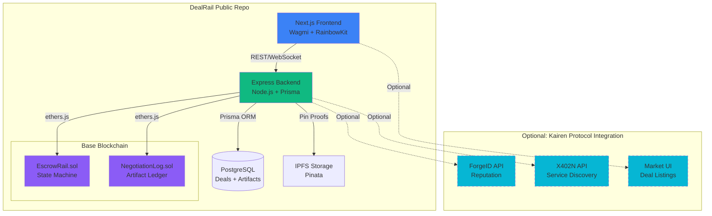

---

## 2. Smart Contract State Machine

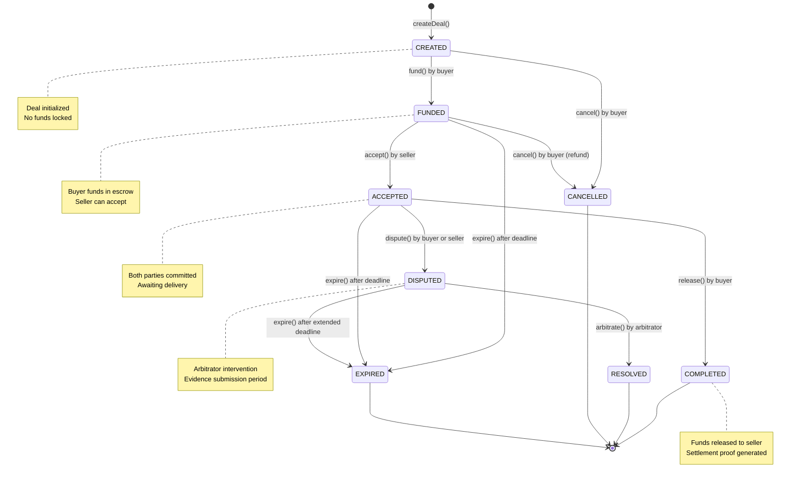

---

## 3. Deal Lifecycle Flow

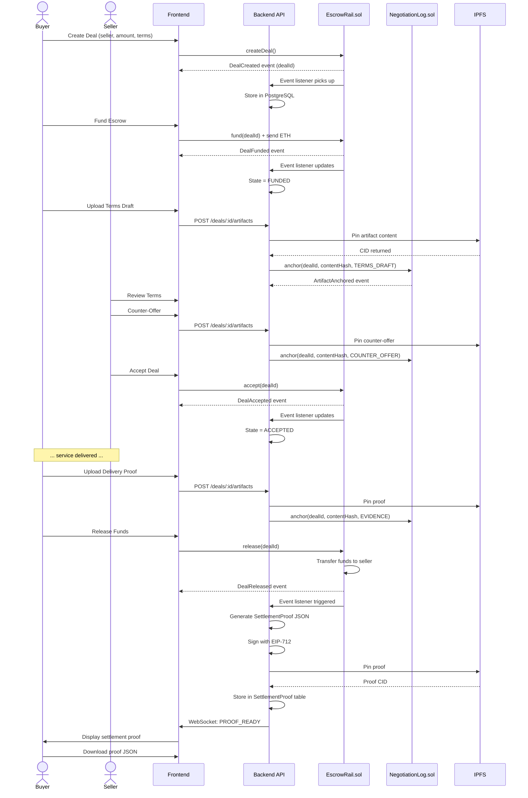

---

## 4. Integration Architecture (Kairen Protocol)

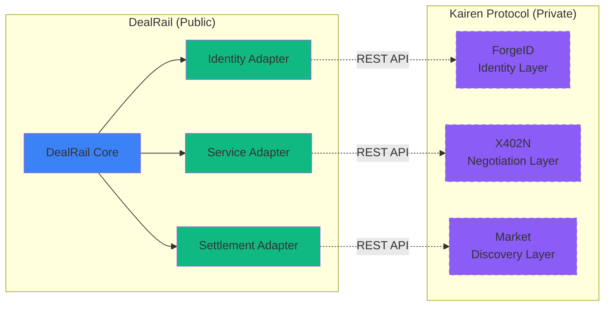

**Adapter Pattern**:
- **Identity Adapter**: Verifies Forge Score (0-1000) before deal acceptance
- **Service Adapter**: Imports service listings from X402N catalog
- **Settlement Adapter**: Posts settlement proofs to Kairen audit log

**All adapters are**:
- Interface-based (no tight coupling)
- Environment-configurable (enable/disable via ENV)
- Gracefully degrading (DealRail works without them)

---

## 5. Data Flow: Settlement Proof Generation

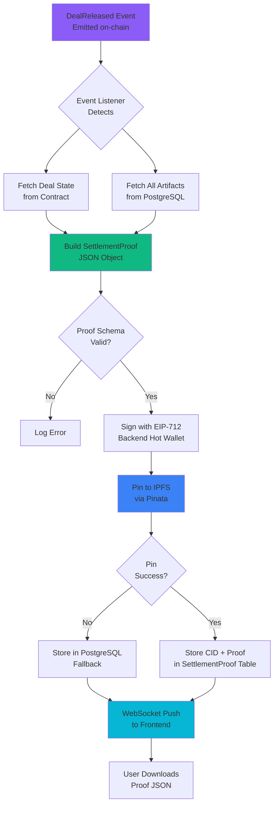

**SettlementProof JSON Schema**:
```json
{
  "version": "1.0",
  "dealId": 123,
  "chainId": 84532,
  "contractAddress": "0x...",
  "finalState": "COMPLETED",
  "parties": {
    "buyer": "0x...",
    "seller": "0x..."
  },
  "amounts": {
    "total": "1000000000000000000",
    "buyerReceived": "0",
    "sellerReceived": "1000000000000000000"
  },
  "metadata": {
    "termsHash": "0x...",
    "settlementTxHash": "0x...",
    "settlementBlock": 12345678,
    "timestamp": 1710432000
  },
  "artifacts": [
    {
      "seq": 1,
      "kind": "TERMS_DRAFT",
      "contentHash": "0x...",
      "ipfsCid": "Qm..."
    }
  ],
  "signature": {
    "r": "0x...",
    "s": "0x...",
    "v": 27,
    "signer": "0x..."
  }
}
```

---

## 6. Technology Stack

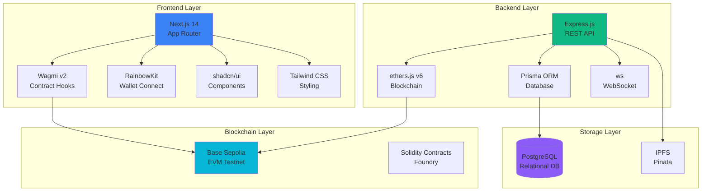

---

## 7. Deployment Architecture

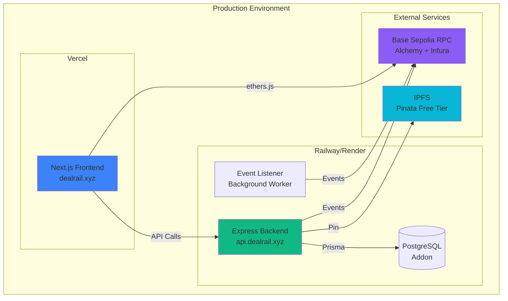

**Environment Variables**:
```bash
# Frontend (Vercel)
NEXT_PUBLIC_RPC_URL=https://sepolia.base.org
NEXT_PUBLIC_ESCROW_ADDRESS=0x...
NEXT_PUBLIC_API_URL=https://api.dealrail.xyz/v1

# Backend (Railway)
DATABASE_URL=postgresql://...
RPC_URL=https://base-sepolia.g.alchemy.com/v2/...
PRIVATE_KEY=0x...  # Proof signer (NOT arbitrator)
PINATA_JWT=...
ESCROW_ADDRESS=0x...
LOG_ADDRESS=0x...
```

---

## 8. Security Architecture

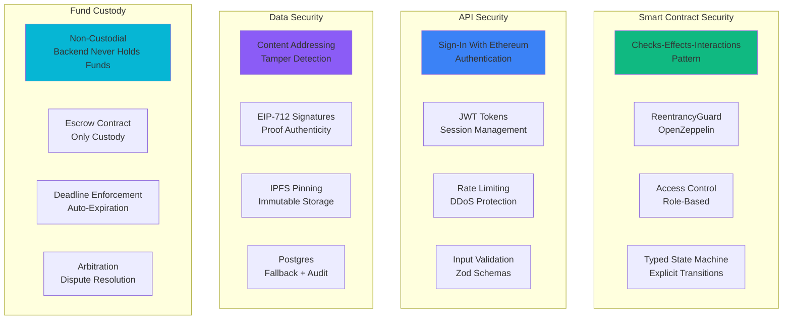

**Security Invariants**:
1. **Backend never custodies funds**: Only EscrowRail.sol holds ETH/ERC20
2. **Artifacts are content-addressed**: Hash anchored on-chain prevents tampering
3. **All state transitions are access-controlled**: Only authorized roles can trigger
4. **Settlement proofs are signed**: EIP-712 signature ensures authenticity
5. **Deadlines are enforceable**: Anyone can call `expire()` post-deadline

---

## 9. Testing Pyramid

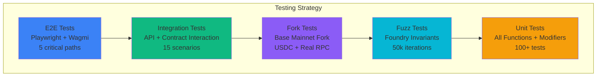

**Test Coverage Goals**:
- Smart Contracts: >90% coverage (measured with `forge coverage`)
- Backend API: >80% coverage (Jest)
- Frontend: >70% coverage (React Testing Library)

**Critical Invariants (Fuzz Tests)**:
1. `escrow.balance == sum(deals.amount) for deals in {FUNDED, ACCEPTED}`
2. `deal.state` can only reach one terminal state
3. `funds never lost or double-spent`

---

## 10. Development Workflow

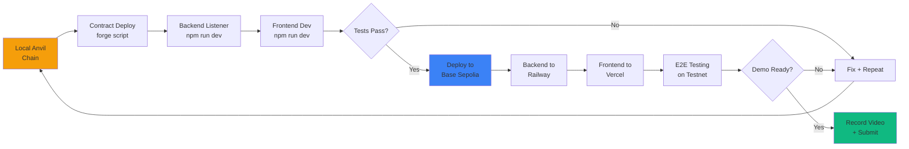

---

## 11. Kairen Ecosystem Integration (Optional Layer)

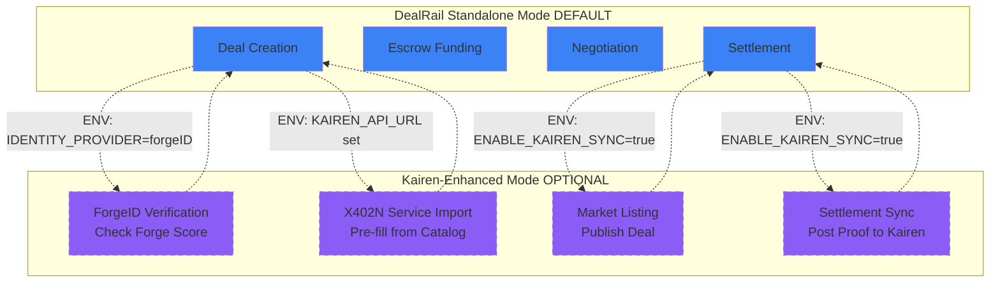

**Toggle Behavior**:
- **Standalone Mode** (default): All Kairen features disabled, DealRail fully functional
- **Kairen-Enhanced Mode**: Optional features enabled via ENV variables
- **Graceful Degradation**: If Kairen API unavailable, DealRail continues working

---

## Summary

These diagrams provide:
1. **System Overview**: How all components fit together
2. **State Machine**: Contract lifecycle visualization
3. **Sequence Flows**: Step-by-step deal execution
4. **Integration Architecture**: Clean separation between public DealRail and private Kairen
5. **Data Flows**: Settlement proof generation pipeline
6. **Tech Stack**: Framework and library choices
7. **Deployment**: Production environment architecture
8. **Security Model**: Multi-layer protection
9. **Testing Strategy**: Comprehensive coverage pyramid
10. **Development Workflow**: Local → Testnet → Production
11. **Kairen Integration**: Optional enhancement layer

Use these diagrams for:
- Hackathon presentation slides
- Judge explanations during demo
- Developer onboarding documentation
- Architecture decision records

---

**Next Steps**:
1. Review diagrams for accuracy
2. Export as PNG/SVG for presentation deck
3. Reference in README.md and ARCHITECTURE.md
4. Update as implementation progresses
