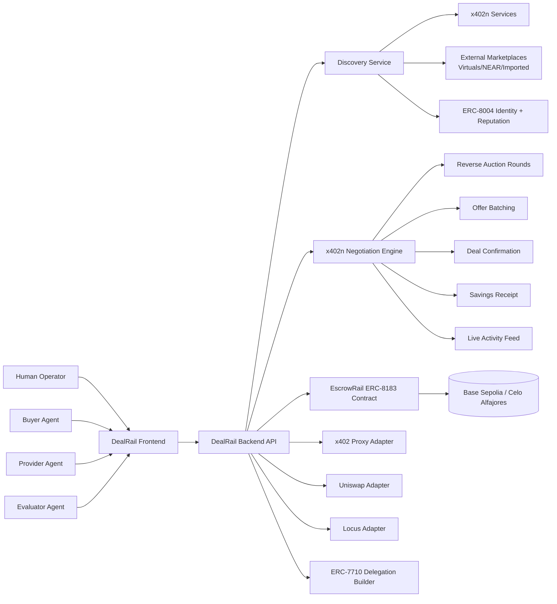
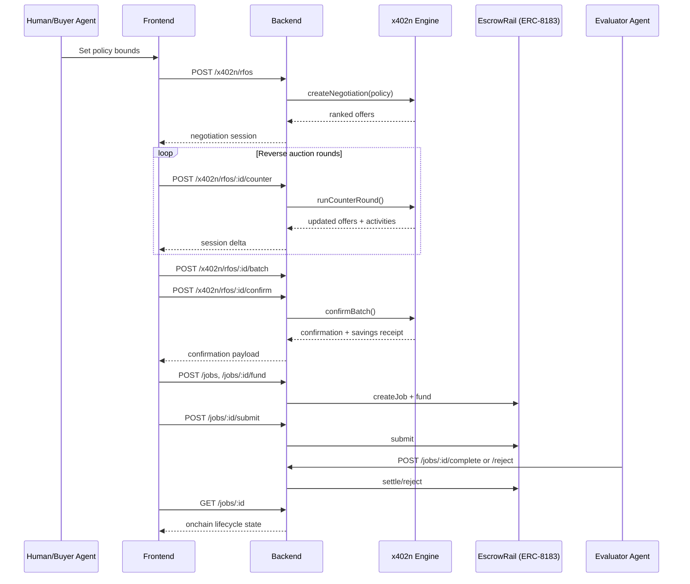

# DealRail Architecture — Latest Iteration (March 17, 2026)

## Scope
This document reflects the currently implemented stack in `kairen-dealrail` after adding:
- reverse auction rounds
- offer batching + deal confirmation
- savings receipt
- live activity feed
- dual payment mode support (`x402` simple pay-per-call and `x402n` negotiated deals)

## Core Product Shape
DealRail is a deals execution rail and aggregation layer:
- Discovery: x402n + external sources + imported catalogs + ERC-8004 identity enrichment
- Negotiation: x402n bridge with reverse-auction rounds and scoring
- Commitment: ERC-8183 escrow onchain
- Settlement: complete/reject/refund lifecycle with evaluator
- Extensions: Uniswap, Locus, MetaMask Delegation, x402 proxy rail

## Visual Architecture

## Runtime Sequence (Negotiated Path)

## API Surface (Current)
### Negotiation + Secret Sauce
- `POST /api/v1/x402n/rfos`
- `POST /api/v1/x402n/rfos/:negotiationId/counter`
- `POST /api/v1/x402n/rfos/:negotiationId/batch`
- `POST /api/v1/x402n/rfos/:negotiationId/confirm`
- `GET /api/v1/x402n/rfos/:negotiationId/receipt`
- `GET /api/v1/x402n/rfos/:negotiationId/activities`

### Escrow Lifecycle (ERC-8183)
- `POST /api/v1/jobs`
- `POST /api/v1/jobs/:jobId/fund`
- `POST /api/v1/jobs/:jobId/submit`
- `POST /api/v1/jobs/:jobId/complete`
- `POST /api/v1/jobs/:jobId/reject`
- `POST /api/v1/jobs/:jobId/claim-refund`

### Discovery + Identity
- `GET /api/v1/discovery/sources`
- `GET /api/v1/discovery/providers`
- `POST /api/v1/discovery/providers/import`
- `GET /api/v1/agents/:address`

### Execution Adapters
- `GET /api/v1/execution/providers`
- `POST /api/v1/execution/submit`
- `GET /api/v1/integrations/uniswap/quote`
- `GET /api/v1/integrations/uniswap/post-settlement/:jobId`
- `POST /api/v1/integrations/locus/send-usdc`
- `POST /api/v1/integrations/metamask/delegation/build`
- `GET /api/v1/integrations/x402/status`
- `POST /api/v1/integrations/x402/proxy`

## Track Mapping
- Open Synthesis: full end-to-end pipeline with real autonomous decision points
- ERC-8004: identity + reputation lookup/enrichment path in discovery and agent endpoint
- Celo: chain config path available; pending full Celo contract address finalization and demo run
- MetaMask Delegation: ERC-7710 payload builder and typed-sign flow integrated
- Integrations: x402, x402n, Uniswap, Locus adapters exposed

## What Is Still Manual / External
1. Celo deployment addresses are still required in `.env` for active Celo end-to-end demo:
- `ESCROW_RAIL_CELO_ALFAJORES`
- `ESCROW_RAIL_ERC20_CELO_ALFAJORES`
- `DEALRAIL_HOOK_CELO_ALFAJORES`
- `ERC8004_VERIFIER_CELO_ALFAJORES`
2. `LOCUS_API_KEY` is optional when mock mode is enabled, required for live Locus calls.
3. `PINATA_JWT` is optional until IPFS pinning is used in the flow.

## Frontend Build Status
- Updated to Next.js `16.1.7`
- Production build now passes with webpack mode (`next build --webpack`)
- Remaining warnings are non-blocking (MetaMask SDK optional RN storage module, Reown 403 for placeholder project id)
