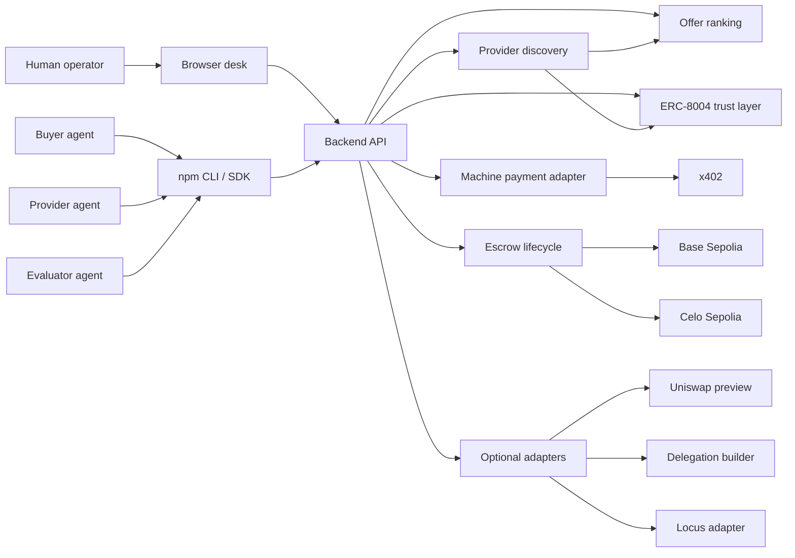

# Architecture

This document describes the architecture DealRail can truthfully claim today.

## Core Shape

DealRail has five layers:

1. Human and agent entry surfaces
2. Provider scan and competition
3. Payment or escrow commitment
4. Trust and reputation hooks
5. Optional post-settlement adapters

## High-Level Map



## Canonical Truth

### What is fully real

- Base Sepolia escrow lifecycle
- Celo Sepolia happy and reject flows
- ERC-8004 verifier and hook integration
- x402 paid-request proof
- public Base service directory
- live browser desk
- live backend API
- published npm package

### What is real but currently curated

- provider discovery
- offer ranking and negotiation sessions

In mock mode, discovery and negotiation now use the same curated catalog. That means the competition story is coherent, but it is still a curated demo market rather than a fully live open marketplace.

The new Base directory makes that posture explicit instead of burying it:
- public endpoint surface is real
- visible supply is real
- market openness is still limited by the connected feeds

### What is preview-only

- Base-only Uniswap post-settlement routing preview
- MetaMask delegation payload builder

## Safety Boundary

The public backend does not accept raw private keys for settlement routes.

Current public mutating backend modes:
- `managed_demo_signer` for the configured demo buyer, provider, and evaluator
- direct user-controlled wallet writes from the browser

That keeps the public product surface honest and safer.

## Canonical Scenario

```text
intent -> discovery -> ranked offers -> choose execution posture
then -> x402 immediate call OR escrow-backed deal
then -> provider submit -> evaluator complete or reject
then -> receipt, trust signal, optional routing preview
```

## Execution Paths

### Path A: Immediate machine payment

Use when:
- the endpoint is already known
- the buyer wants a pay-per-call interaction

Flow:
1. operator chooses x402
2. backend proxies the request
3. paid response comes back
4. receipt becomes evidence

### Path B: Escrow-backed deal

Use when:
- the buyer wants scoped delivery and dispute handling
- the work requires a provider and evaluator role

Flow:
1. operator defines job
2. buyer funds escrow
3. provider submits deliverable
4. evaluator completes or rejects
5. hook can write trust feedback

### Path C: Post-settlement routing preview

Use when:
- a Base Sepolia job is completed
- the operator wants a treasury-routing preview

Current limit:
- Base-only preview
- not a sponsor-grade Uniswap proof

### Path D: Base-facing public service directory

Use when:
- a judge or operator wants the clearest Base-specific product surface
- the goal is to inspect public endpoints, settlement posture, and visible supply

Flow:
1. open `/base` or call `GET /api/v1/base/agent-services`
2. inspect public surfaces and settlement rail
3. confirm whether visible supply is curated or blended

## Component Map

### Frontend

- browser desk and terminal demo
- Base-facing service directory page
- job detail pages with chain-safe writes
- integrations workbench with preview-only labeling where needed

Key files:
- `frontend/src/app/page.tsx`
- `frontend/src/app/base/page.tsx`
- `frontend/src/app/jobs/[jobId]/page.tsx`
- `frontend/src/components/HomeCommandTerminal.tsx`
- `frontend/src/components/IntegrationsWorkbench.tsx`
- `frontend/src/lib/api.ts`
- `frontend/src/lib/contracts.ts`

### CLI / SDK

- stable human mode
- stable `--json` mode for agents
- live package: `@kairenxyz/dealrail`

Key files:
- `cli/src/cli.ts`
- `cli/src/client.ts`
- `cli/src/types.ts`

### Backend

- chain-aware simplified API
- safe public route boundary
- coherent discovery and negotiation
- public Base service directory
- machine payments, trust, and preview adapters

Key files:
- `backend/src/index-simple.ts`
- `backend/src/services/base-agent-services.service.ts`
- `backend/src/services/contract.service.ts`
- `backend/src/services/discovery.service.ts`
- `backend/src/services/x402n.service.ts`
- `backend/src/services/machine-payments.service.ts`

### Contracts

- escrow state machine
- hook callbacks
- ERC-8004-aware trust gating and reputation writes

Key files:
- `contracts/src/EscrowRail.sol`
- `contracts/src/EscrowRailERC20.sol`
- `contracts/src/DealRailHook.sol`
- `contracts/src/identity/ERC8004Verifier.sol`

## Architectural Notes For Judges

- DealRail is best judged as a real escrow-and-receipts system with strong operator packaging.
- The marketplace claim should be read as curated and coherent, not fully open and live.
- The Uniswap and delegation surfaces should be read as preview/builder surfaces, not recorded sponsor proofs.
