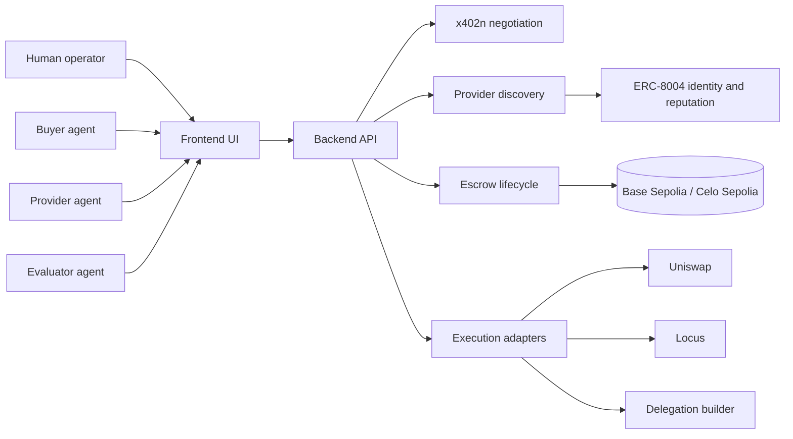
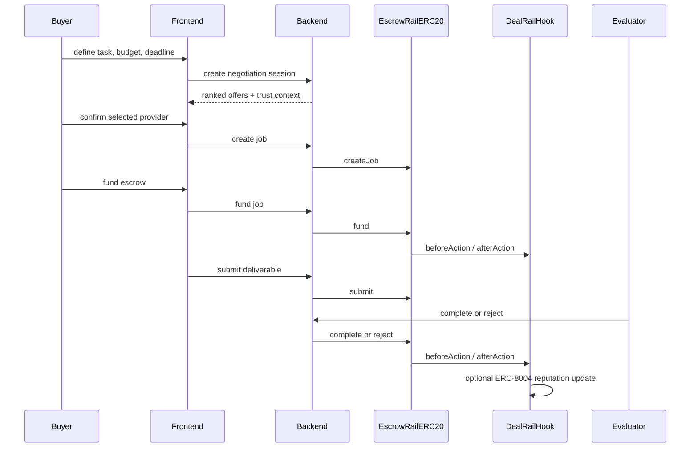

# Architecture

This document describes the canonical architecture currently supported by the repo.

For the visual version, read [`06_VISUAL_ARCHITECTURE.md`](06_VISUAL_ARCHITECTURE.md).

## System Shape

DealRail has four layers:

1. Discovery and negotiation
2. Onchain escrow and settlement
3. Trust and reputation hooks
4. Optional downstream execution adapters

## High-Level System Map



## Canonical Demo Path

The clearest demo path uses:

- frontend: [`frontend/src/app`](../../frontend/src/app)
- simplified backend API: [`backend/src/index-simple.ts`](../../backend/src/index-simple.ts)
- contract interaction service: [`backend/src/services/contract.service.ts`](../../backend/src/services/contract.service.ts)
- escrow contracts: [`contracts/src/EscrowRailERC20.sol`](../../contracts/src/EscrowRailERC20.sol) and [`contracts/src/EscrowRail.sol`](../../contracts/src/EscrowRail.sol)

## Component Map

### Frontend

The frontend is a Next.js operator UI that:
- displays jobs and lifecycle state
- creates jobs
- surfaces negotiation and integrations workbench flows
- points users to onchain actions and backend adapters

Important files:
- [`frontend/src/app/page.tsx`](../../frontend/src/app/page.tsx)
- [`frontend/src/app/jobs/[jobId]/page.tsx`](../../frontend/src/app/jobs/[jobId]/page.tsx)
- [`frontend/src/lib/contracts.ts`](../../frontend/src/lib/contracts.ts)
- [`frontend/src/lib/api.ts`](../../frontend/src/lib/api.ts)

### Backend

The canonical submission backend is the simplified API server:
- no database required for the main escrow demo path
- reads directly from chain
- exposes lifecycle endpoints
- exposes negotiation, discovery, delegation, Uniswap, Locus, and x402-related surfaces

Important files:
- [`backend/src/index-simple.ts`](../../backend/src/index-simple.ts)
- [`backend/src/services/x402n.service.ts`](../../backend/src/services/x402n.service.ts)
- [`backend/src/services/discovery.service.ts`](../../backend/src/services/discovery.service.ts)
- [`backend/src/services/delegation.service.ts`](../../backend/src/services/delegation.service.ts)
- [`backend/src/services/uniswap.service.ts`](../../backend/src/services/uniswap.service.ts)
- [`backend/src/services/locus.service.ts`](../../backend/src/services/locus.service.ts)
- [`backend/src/services/execution.service.ts`](../../backend/src/services/execution.service.ts)

### Contracts

The smart contract layer provides:
- escrow state machine
- hook callbacks before and after key actions
- pluggable identity verification
- ERC-8004-aware trust gating and reputation writes

Important files:
- [`contracts/src/EscrowRail.sol`](../../contracts/src/EscrowRail.sol)
- [`contracts/src/EscrowRailERC20.sol`](../../contracts/src/EscrowRailERC20.sol)
- [`contracts/src/DealRailHook.sol`](../../contracts/src/DealRailHook.sol)
- [`contracts/src/identity/ERC8004Verifier.sol`](../../contracts/src/identity/ERC8004Verifier.sol)
- [`contracts/test/EscrowRailERC20Hook.t.sol`](../../contracts/test/EscrowRailERC20Hook.t.sol)

## Runtime Sequence

```text
buyer policy -> x402n negotiation -> provider selection -> createJob -> fund
provider submit -> evaluator complete/reject -> escrow releases or refund path remains available
after settlement -> DealRailHook can write ERC-8004 reputation
optional -> prepare downstream Uniswap / Locus / delegation operations
```

## Canonical Settlement Flow



## What Is Implemented Versus Optional

### Implemented and evidenced
- Base Sepolia escrow flow
- Celo Sepolia escrow flow
- reject path on Celo
- ERC-8004 verifier and hook integration
- discovery enrichment against ERC-8004 registries

### Implemented but not core-evidenced
- reverse-auction style negotiation sessions
- delegation payload building
- Uniswap quote and tx building
- Locus bridge
- x402 proxy path

## Chain Topology

### Base Sepolia
- primary testnet for canonical escrow evidence
- current default backend target

### Celo Sepolia
- secondary testnet with stable-token rail
- used for sponsor-specific Celo evidence

## Architectural Truthfulness Notes

- The simplified backend is the canonical demo server for this submission.
- Database-backed and IPFS-heavy paths exist in the repo but are not required to understand the demonstrated prize path.
- Optional sponsor adapters are documented separately so they do not muddy the core story.
